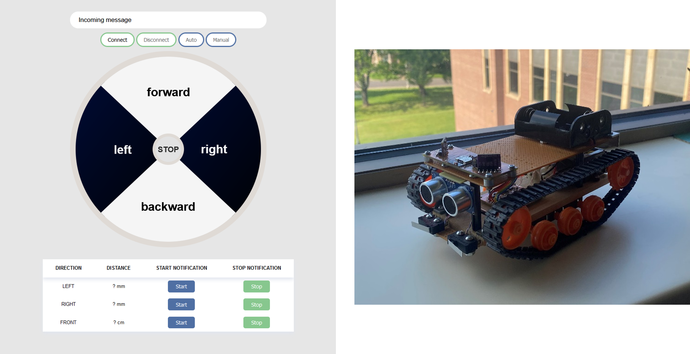

# Trackbot Project
Welcome to the Trackbot project! This project involves developing a simple robot using two different proximity sensors (Time-of-Flight and Ultrasonic) to navigate and avoid obstacles autonomously. The project integrates hardware components with software implementations in C and JavaScript, enabling real-time control and monitoring through a web interface.

## Features

- **Autonomous Navigation:** The Trackbot uses VL53L0X ToF sensors and an ultrasonic sensor to measure distances, allowing it to detect obstacles and adjust its path automatically.
- **Manual and Auto Control:** The Trackbot can be controlled manually via a web interface or set to autonomous mode, where it navigates on its own. If not connected to web, the program defaults to auto mode.
- **Real-Time Distance Monitoring:** Distance readings from the sensors are updated in real-time on the web interface.
- **Bluetooth Connectivity:** The Trackbot connects via Bluetooth, allowing wireless control and communication.

## Components

### Hardware

- **VL53L0X ToF Sensors:** These sensors are used to measure the distance of obstacles on both sides of the Trackbot.
- **Ultrasonic Sensor:** Measures the distance of obstacles in front of the Trackbot, enhancing its ability to detect and avoid obstacles.
- **Microcontroller:** The Trackbot is powered by the EFR32MG12P Microcontroller, which manages the sensor readings and controls the motors based on the distance data.
- **Motors:** Drives the Trackbot forward, backward, left, or right, based on sensor inputs.

### Software
#### Trackbot firmware
- **Simplicity Studio IDE v.5** is used.
- **C Code:** Handles the initialization and processing of sensor data and controls the motors accordingly. The core logic is implemented in `main.c`, `app.c`, and `VL53L0X.c`.
#### Web application
- **JavaScript (Web Interface):** 
  - The `main.js` file handles the connection to the Trackbot via Bluetooth, updates the sensor readings on the web page, and sends control commands based on user inputs.
  - **Bluetooth API:** The Trackbot uses the Web Bluetooth API to establish a connection with the browser and facilitate communication between the web interface and the microcontroller. The API allows for the control of the Trackbot's movements and the reception of real-time sensor data directly within a web browser.
- **HTML/CSS:** The `index.html` and `main.css` files create the user interface, allowing users to control and monitor the Trackbot through a web browser.

### Acknowledgements
- Professor Sergei Bezroukov: Special thanks to Professor Sergei Bezroukov for providing guidance and assistance with the hardware connections and overall setup of the Trackbot.
